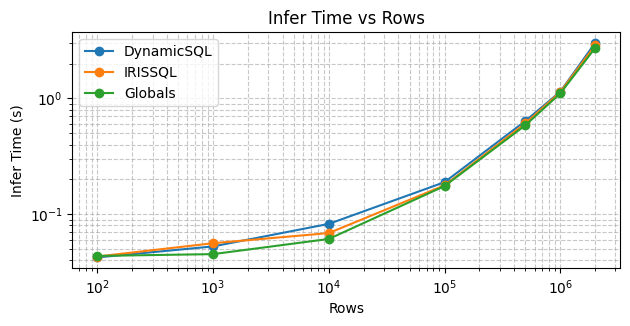
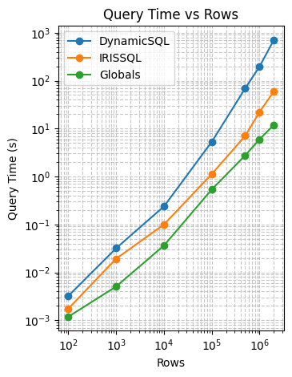

# IRIS Dockerization and Embedded Python for Data Science

Before joining InterSystems, I worked in a team of web developers as a data scientist. Most of my day-to-day work involved training and embedding ML models in Python-based backend applications through microservices, mainly built with the Django framework and using Postgres SQL for sourcing the data. During development, testing, and deployment, I realized the importance of repeatability of results, both for the model’s inferences and for the performance inside the application, regardless of the hardware being used to run the code.

This naturally went hand in hand with adopting good coding practices, such as modularization to reduce code repeatability and boilerplate, making maintenance easier and speeding up development. For this reason, Docker in particular became an essential tool in our workflow, not only for scalability and ease of deployment, but also to reduce human error and ensure that code behaves the same way everywhere, regardless of the underlying machine.

When I joined InterSystems, I was immediately impressed by the robustness of IRIS as a data platform. Its resilience to human error when following guidelines to create services through productions, the multi-model nature of how information can be stored, and, in particular, the lightning-fast access to data through globals opened my eyes to a different way of thinking about performance and data access patterns, especially when compared to a traditional relational-only mindset.

I was also lucky to join the company (September 2025) at a time when a rich ecosystem of tools was already in place, significantly flattening the learning curve. The VS Code ObjectScript Extension Pack, Embedded Python, the official IRIS Docker images, and the InterSystems Package Manager (IPM) for easily importing ObjectScript packages (https://github.com/intersystems/ipm) quickly became my everyday toolbelt.

After about three months, I felt confident enough working with this stack that I started standardizing my own development environment. In this article, I’d like to share how I set up a fully containerized IRIS instance for Data Science projects using Docker—ready to use Embedded Python out of the box, with all required dependencies installed from both Python’s `pip` and IPM.

I’ll also use this setup to share some insights on the incredible speed of using globals to query tables, in a practical scenario where the popular gradient boosting model **LightGBM** is used to train and make inferences on a mock dataset. This allows us to measure inference speed while comparing the different querying approaches available in IRIS.

Some important highlights that will be addressed in this article are how to:

- Link custom Python packages during the Docker build process, so they can be imported naturally (e.g. `from mypythonpackage import myclassorfunc`) inside any Embedded Python methods living on ObjectScript classes, without repetitive boilerplate.

- Automatically execute IRIS terminal commands as soon as the container starts, which in this scenario is used to:

  - Import custom ObjectScript packages into IRIS.

  - Install IPM and, through it, Shavrov’s `csvgenpy` utility  
    (https://community.intersystems.com/post/csvgenpy-import-any-csv-intersystems-iris-using-embedded-python),  
    used to create and populate new tables from a single CSV file.

  - Check whether an IRIS table already exists and, if it doesn’t, populate it using `csvgenpy` with a CSV file mounted into the container via Docker volumes.

  All of this by only running:

  ```bash
  docker-compose up --build
  ```

Finally, the repository accompanying this article uses this setup to create a complete IRIS environment with all the tools and data needed to compare different ways of querying the same IRIS table and converting the results into a Pandas DataFrame (NumPy-based), which is typically what gets passed to Python-based machine learning models.

The comparison includes:

- Dynamic SQL queries

- Pandas querying the table directly

- Direct access through globals

For each approach, execution time is measured to quantitatively compare the performance of the different querying methods. This analysis shows that direct global access provides the lowest-latency data retrieval for machine learning inference workloads by far.

At the same time, consistency across querying methods is validated by asserting equality of the resulting Pandas DataFrames, ensuring that identical dataframes (and therefore identical downstream ML predictions) are produced regardless of the query mechanism used.


## Project Structure

```
.
├── docker-compose.yml             # Docker orchestration configuration
├── dockerfile                     # Multi-stage build with IRIS + Python
├── iris_autoconf.sh               # Auto-configuration script for IRIS terminal commands
├── requirements.txt               # Python libraries
├── MockPackage/                   # Custom package
│   ├── MockDataManager.cls        # Data management utilities
│   ├── MockModelManager.cls       # ML model training
│   └── MockInference.cls          # Data retrieval and inference benchmarks
├── python_utils/                  # Custom Python packages
│   ├── __init__.py
│   ├── utils.py                   # ML preprocessing & inference
|   └── querymethods.py            # Methods for Querying IRIS tables
└── dur/                           # Volume for durable data on host machine and container
    ├── data/                      # CSV datasets
    └── models/                    # Trained LightGBM models
```

## Dockerization of IRIS

This section describes the main building blocks used to dockerize a Python-ready IRIS instance. The goal here is not only to run IRIS inside a container, but to do so in a way that makes it immediately usable for Data Science workflows: Embedded Python enabled, Python dependencies installed, ObjectScript packages available through IPM, and data automatically loaded when the container starts.

The setup relies on three main components:

- `docker-compose.yml` to define how the IRIS container is built and run
- a multi-stage `Dockerfile` to prepare Embedded Python and dependencies
- an `iris_autoconf.sh` script to automate IRIS-side configuration at startup

### docker-compose.yml

```
version: '3.8'

services:
  iris:
    build: # How is the image built
      context: . # Path to the directory containing the Dockerfile
      dockerfile: Dockerfile # Name of the Dockerfile
    container_name: iris-experimentation # Name of the container
    ports:
      - "1972:1972"    # SuperServer port
      - "52773:52773"  # Management Portal/Web Gateway
    volumes:
      - ./dur/.:/dur:rw # map host directory to container directory with read-write permissions
    restart: always # Always restart the container if it stops (unless explicitly stopped)
    healthcheck:
      test: ["CMD", "iris", "session", "iris", "-U", "%SYS", "##class(SYS.Database).GetMountedSize()"] # Health check command
      interval: 30s
      timeout: 10s
      retries: 3
      start_period: 40s
    command: --after "/usr/irissys/iris_autoconf.sh" # Run autoconf script after startup

```


Docker Compose specifies how the IRIS container is built, which ports are exposed, how storage is handled, and what commands are executed at startup. In particular, I want to highlight the following points:

- **`volumes: ./dur/.:/dur:rw`**

  This creates the `/dur` directory inside the container and maps it to `./dur` (relative to the location of `docker-compose.yml`) on the host machine, with both read and write permissions.

  In practice, this means that both the host machine and the container share the same path. This makes it very easy to load files into IRIS and inspect or modify them from the host without any extra copying steps.

  In this project, this is how the `/data` and `/models` folders are directly made available inside the container under `/dur`.

- **`command: --after "/usr/irissys/iris_autoconf.sh"`**

  This command allows the execution of a bash script immediately after the container is up and running. The script contains all the commands needed to open an IRIS terminal session and execute any required IRIS-side configuration.

  **NOTE:** The commands in this script are executed every time the container starts. This means that if the container goes down for any reason and restarts (for example, due to `restart: always`), all the commands in this script will be executed again. If this behavior is not taken into account when writing the script, it can lead to unintended side effects such as reinstalling packages or resetting tables.

### dockerfile
```
# Stage 1: Build stage for installing dependencies
FROM python:3.12-slim AS builder

# Set the working directory
WORKDIR /app

# Copy the requirements file into the image
COPY requirements.txt requirements.txt

# Install the Python dependencies into a temporary location
RUN pip install --no-cache-dir --target /install -r requirements.txt

# Stage 2: Final image with InterSystems IRIS and the installed Python libraries
FROM containers.intersystems.com/intersystems/iris-community:latest-em

# Switch to the root user to install necessary system packages
USER root

# Install the correct Python 3.12 development library for Ubuntu Noble
RUN apt-get update && apt-get install -y libpython3.12-dev wget && \
    rm -rf /var/lib/apt/lists/*

# Set the environment variables for Embedded Python
ENV PythonRuntimeLibrary=/usr/lib/x86_64-linux-gnu/libpython3.12.so
ENV PythonRuntimeLibraryVersion=3.12

# Update the LD_LIBRARY_PATH
ENV LD_LIBRARY_PATH=/usr/lib/x86_64-linux-gnu:${LD_LIBRARY_PATH}

# Copy the installed Python packages from the builder stage
COPY --from=builder /install /usr/irissys/mgr/python

# Your own Python package
COPY python_utils /usr/irissys/mgr/python/python_utils
ENV PYTHONPATH=/usr/irissys/mgr/python:${PYTHONPATH}


# Copy ObjectScript classes into the image
COPY MockPackage /usr/irissys/mgr/MockPackage
# Copy and set permissions for the autoconf script while still root
COPY iris_autoconf.sh /usr/irissys/iris_autoconf.sh
RUN chmod +x /usr/irissys/iris_autoconf.sh

# Switch back to the default `irisowner` user
USER irisowner
```


This is a two-stage Dockerfile.

The first stage is a lightweight build stage used to install all Python dependencies listed in `requirements.txt` into a temporary directory. This keeps the final image clean and avoids installing build tools directly into the IRIS image.

The second stage is based on the official InterSystems IRIS image. Here, the Python runtime library required for Embedded Python is installed, and IRIS is configured so that Embedded Python can recognize both the runtime library and all installed Python packages, including custom ones.

It is worth highlighting the following configuration:

- **Embedded Python runtime configuration**


    ```
    ENV PythonRuntimeLibrary=/usr/lib/x86_64-linux-gnu/libpython3.12.so
    ENV PythonRuntimeLibraryVersion=3.12
    ```


These environment variables achieve what would otherwise be configured manually through the Management Portal by navigating to:

`System Administration → Configuration → Additional Settings → Advanced Memory`

and updating the Embedded Python runtime settings. Defining them in the Dockerfile makes the configuration explicit, reproducible, and version-controlled.

Additionally, the classes inside the package "MockPackage" are copied inside the container through:

`COPY MockPackage /usr/irissys/mgr/MockPackage`

to be later on, automatically imported to IRIS when the the following bash file is executed after the container is up and running.

### iris_autoconf.sh

```
#!/bin/bash
set -e

iris session IRIS <<'EOF'

/* Install IPM/ZPM client if you still need that first
   (your original snippet did this already) */
s version="latest" s r=##class(%Net.HttpRequest).%New(),r.Server="pm.community.intersystems.com",r.SSLConfiguration="ISC.FeatureTracker.SSL.Config" d r.Get("/packages/zpm/"_version_"/installer"),$system.OBJ.LoadStream(r.HttpResponse.Data,"c")

/* Configure registry */
zpm
repo -r -n registry -url https://pm.community.intersystems.com/ -user "" -pass ""
install csvgenpy
quit

/* Import and Compile the MockPackage */
/* The "ck" flags will Compile and Keep the source */
Do $system.OBJ.Import("/usr/irissys/mgr/MockPackage", "ck")

/* Upload csv data ONCE to Table Automatically using csvgenpy */
SET exists = ##class(%SYSTEM.SQL.Schema).TableExists("MockPackage.NoShowsAppointments")
IF 'exists {   do ##class(shvarov.csvgenpy.csv).Generate("/dur/data/healthcare_noshows_appointments.csv","NoShowsAppointments","MockPackage")   }

halt
EOF
```


This is a bash script that is executed inside the container immediately after startup. It opens an IRIS terminal session using `iris session IRIS` and runs IRIS-specific commands to perform additional configuration steps automatically.

These steps include importing custom packages whose classes were copied inside the container's storage, installing IPM (available as `zpm` inside the IRIS terminal), installing IPM packages such as `csvgenpy`, and using `csvgenpy` to load a CSV file mounted into the container at `/dur/data/healthcare_noshows_appointments.csv` to create and populate a corresponding table in IRIS.

**NOTE:** This script is executed every time the container starts. If this behavior is not considered, it can lead to unintended side effects such as reloading or resetting data. That is why it is important to make the script safe to run multiple times, for example, by checking whether the target table already exists before creating or populating it. This is especially relevant here because the Docker Compose restart policy is set to `restart: always`, meaning the container will automatically restart and re-execute these commands whenever it goes down.


## Packages for Benchmarking

This section introduces the ObjectScript packages used to benchmark different data access strategies in IRIS for a Machine Learning inference workload. The focus here is not on model quality, but on measuring and comparing the time it takes to retrieve data from IRIS, convert it into a Pandas DataFrame, and run inference using a trained LightGBM model.

Each class plays a specific role in this process, from data preparation, to model training, and finally to inference and performance comparison.

### MockDataManager.cls

This class contains methods for taking a given CSV file and duplicating its rows to reach a desired dataset size (`AdjustDataSize`), as well as updating a given IRIS table with the specified CSV (`UpdateTableFromCSV`). The main purpose of these utilities is to allow testing query and inference time across multiple table sizes in a controlled way.

Note: Throughout this analysis, we focus exclusively on the **inference time** of a LightGBM model. We are not concerned with model performance metrics such as F1 score, precision, recall, accuracy, or else at this stage.

### MockModelManager.cls

In this class, the only relevant method is `TrainNoShowsModel`. It leverages the data processing pipeline defined in `python_utils.utils` to prepare the raw data, passed in as a Pandas DataFrame, fit a LightGBM model, and persist the trained model to disk.

The model is saved to a predefined location, which in this setup corresponds to the persistent storage mounted through Docker volumes in `docker-compose.yml`. This allows the trained model to be reused across container restarts and inference runs without retraining.

### MockInference.cls

The core of the performance comparison lives in this class. The process begins by loading the trained LightGBM model weights from the file path specified in the `MODELPATH` parameter. While this path is currently hardcoded, it serves as a static reference point shared by all inference tests.

`RunInferenceWDynamicSQL` represents the first approach. It relies on an ObjectScript method called `DynamicSQL`, which executes a Dynamic SQL statement to filter records by age. The results are packed into a `%DynamicArray` of `%DynamicObjects`. This method is then called by the `dynamic_sql_query` Python function in `python_utils/querymethods.py`, where the IRIS objects are converted into a structure that can be easily transformed into a Pandas DataFrame.

The entire workflow, including execution time measurement via a Python decorator defined in `python_utils/utils.py`, is orchestrated inside `RunInferenceWDynamicSQL`. The resulting DataFrame is then passed through the inference pipeline to produce predictions and measure end-to-end inference latency.

`RunInferenceWIRISSQL` follows a simpler path. It uses the `iris_sql_query` method from `python_utils/querymethods.py` to execute the SQL query directly from Python. The resulting IRIS SQL iterator is transformed directly into a Pandas DataFrame, after which the same inference and timing logic used in the previous method is applied.

`RunInferenceWGLobals` is the most direct approach, as it queries the underlying data structures (globals) backing the table. It uses the `iris_global_query` method to fetch data directly from `^vCVc.Dvei.1`. This particular global was identified as the `DataLocation` in the storage definition of the `MockPackage.NoShowsAppointments` table.

The global name is a result of the hashed storage automatically generated when the table was built from the CSV file.

Finally, the integrity of all three approaches is verified using the `ConsistencyCheck` method. This utility asserts that the Pandas DataFrames produced by each query strategy are identical, ensuring that data types, values, and numerical precision remain perfectly consistent regardless of the access method used.

Because this check raises no errors, it confirms that Dynamic SQL, direct SQL access from Python, and high-speed global access are all returning exactly the same dataset—making performance comparisons both fair and meaningful.


## Performance comparison

To evaluate performance, we measured query and inference times for increasing table sizes and report in the table below the average time over 10 runs for each configuration. Query time corresponds to retrieving the data from the database, while inference time corresponds to running the LightGBM model on the resulting dataset.


| Rows | DynamicSQL – Query | DynamicSQL – Infer | IRISSQL – Query | IRISSQL – Infer | Globals – Query | Globals – Infer |
|-----:|-------------------:|-------------------:|----------------:|----------------:|----------------:|----------------:|
| 100 | 0.003219271 | 0.042354488 | 0.001749706 | 0.043090796 | 0.001184559 | 0.043616056 |
| 1,000 | 0.031865168 | 0.052698898 | 0.019246697 | 0.056159472 | 0.005061340 | 0.045210719 |
| 10,000 | 0.237553477 | 0.082497978 | 0.099582171 | 0.068728352 | 0.036206818 | 0.061128354 |
| 100,000 | 5.279174852 | 0.189197206 | 1.122253346 | 0.177564192 | 0.535172153 | 0.175085044 |
| 500,000 | 68.741133046 | 0.639807224 | 7.015313649 | 0.610818386 | 2.743980526 | 0.58764743804 |
| 1,000,000 | 196.871173100 | 1.145034313 | 22.138613220 | 1.136569023 | 5.987578392 | 1.106307745 |
| 2,000,000 | 711.319680452 | 3.021180152 | 60.142974615 | 2.879153728 | 11.92040014 | 2.728573560 |


To characterize how query and inference times scale with respect to table size, we fitted a power-law regression of the form:

$$
y = a \cdot x^k + c
$$

where:

- $y$ is the execution time in seconds  
- $x$ is the number of rows  
- $a$ is a scaling factor  
- $k$ is the power-law exponent  
- $c$ is a constant offset representing fixed overhead  

In this formulation:

- $k \approx 1$ indicates linear scaling  
- $k < 1$ indicates sublinear scaling  
- $k > 1$ indicates superlinear scaling


### Inference Time



$$
\begin{aligned}
\text{DynamicSQL:} &\quad a = 0.00996 \times 10^{-6},\; k = 1.34,\; c = 0.09 \\
\text{IRISSQL:}    &\quad a = 0.01751 \times 10^{-6},\; k = 1.30,\; c = 0.08 \\
\text{Globals:}    &\quad a = 0.02749 \times 10^{-6},\; k = 1.27,\; c = 0.07 \\ \\

\text{Average:}    &\quad a = 0.01832 \times 10^{-6},\; k = 1.30,\; c = 0.08
\end{aligned}
$$


Inference time is very similar across all three query methods, which is expected, as the resulting input DataFrame was verified to be identical in all cases.

From the measurements, the model is able to perform inference on approximately 1 million rows in about $1$ second, highlighting the high throughput of LightGBM.

The fitted exponent $k \approx 1.3$ indicates slightly superlinear scaling of total inference time with respect to the number of rows. This behavior is commonly observed in large-scale batch processing and is likely attributable to system-level effects such as cache pressure, or memory bandwidth saturation, rather than to the algorithmic complexity of the model itself.

The scaling factor $a$ is on the order of tens of nanoseconds, reflecting the efficiency of the per-row computation. While the superlinear exponent implies that the marginal cost per additional row increases with table size, this effect becomes noticeable only at large scales (millions of rows), as illustrated by the increasing slope in the log–log plot.

The marginal inference cost can be estimated from the derivative of the fitted model:

$$
\frac{dy}{dx} = a \cdot k \cdot x^{k - 1}
$$

Evaluating this expression shows that the per-row marginal inference time increases from approximately $1.9 \times 10^{-7}$ seconds at $10^3$ rows to $1.5 \times 10^{-6}$ seconds at $10^6$ rows, remaining firmly in the microsecond range within the observed data regime.

Finally, the fitted constant offset $c \approx 0.08$ seconds likely represents a fixed inference overhead, such as model invocation and runtime initialization, and should be interpreted as a constant cost independent of table size.


### Query Time



$$
\begin{aligned}
\text{DynamicSQL:} &\quad a = 0.00241 \times 10^{-6},\; k = 1.82,\; c = 1.90 \\
\text{IRISSQL:}    &\quad a = 0.02909 \times 10^{-6},\; k = 1.48,\; c = 0.04 \\
\text{Globals:}    &\quad a = 4.12700 \times 10^{-6},\; k = 1.03,\; c = -0.02 \\
\end{aligned}
$$


Query time exhibits substantially different scaling behavior across the three access methods. In contrast to inference time, which is largely independent of the query mechanism, query performance is dominated by the data access strategy and its interaction with storage and execution layers.

The **Globals-based** approach shows nearly linear scaling ($k \approx 1.03$), indicating that the cost of retrieving each additional row remains approximately constant across the measured range. This behavior is consistent with sequential access patterns and minimal query-planning overhead, making Globals the most scalable option for large result sets.

The **IRISSQL** approach exhibits moderately superlinear scaling ($k \approx 1.48$). While still efficient for moderate table sizes, the increasing marginal cost suggests growing overhead from SQL execution, query planning, or intermediate result materialization as the number of rows increases.

The **DynamicSQL** approach displays the most pronounced superlinear scaling ($k \approx 1.82$), resulting in rapidly increasing query times at larger scales. This behavior explains the steep slope observed in the plot and indicates that DynamicSQL incurs significant additional overhead as result size grows, making it the least scalable method for large batch queries.

Although the fitted scaling factors $a$ are numerically small, they must be interpreted jointly with the exponent $k$. In practice, the exponent dominates the asymptotic behavior, which is why DynamicSQL, despite a small $a$, becomes significantly slower at large table sizes.

The fitted constant term $c$ represents the fixed query overhead. For IRISSQL, $c$ is close to zero, indicating a small startup cost. This overhead is even smaller for the Globals-based approach, where the fitted value is slightly negative, effectively suggesting a zero fixed cost. This behavior is expected, as data retrieval via a global key proceeds directly without additional query planning or execution overhead.

In contrast, the relatively large constant offset observed for DynamicSQL indicates a substantial fixed overhead, likely associated with query preparation or execution setup. This fixed cost penalizes performance across all table sizes and becomes particularly impactful at both small and large scales.

Overall, these results highlight that query time, unlike inference time, is highly sensitive to the data access method, with Globals offering near-linear scalability, IRISSQL providing a balanced middle ground, and DynamicSQL exhibiting poor scalability for large result sets.
